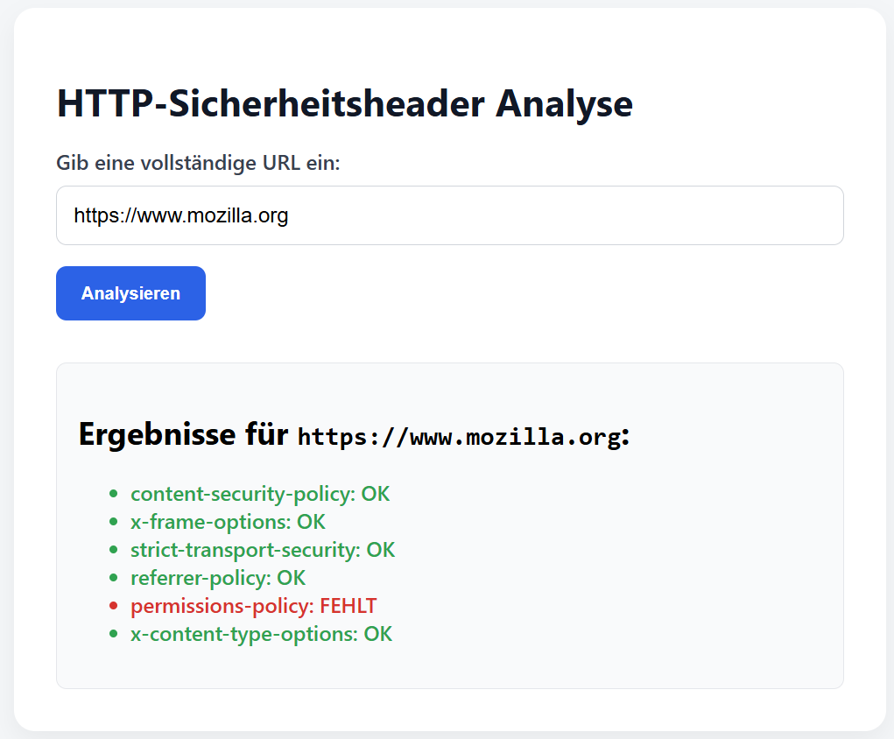
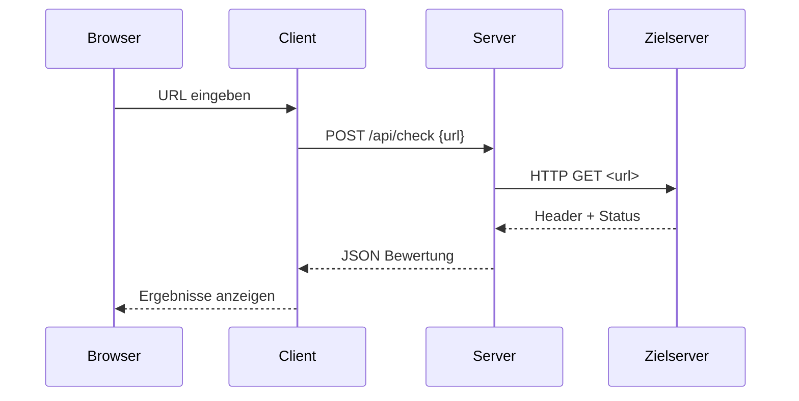

# HTTP‑Sicherheitsheader Checker



## Abstract

Diese Webapplikation prüft beliebige Websites auf das Vorhandensein gängiger HTTP‑Sicherheitsheader. Ein Node.js‑Server auf dem Raspberry Pi ruft die angegebenen URLs ab, analysiert die Antwort‑Header und bewertet ihre Sicherheit. Der Browser‑Client stellt die Ergebnisse in einer übersichtlichen Oberfläche dar.

## Architektur & Funktionsweise

Die Anwendung besteht aus zwei selbstständigen Komponenten:

1. **Server (`server/`)** – Express‑Server mit einem einzigen REST‑Endpoint `/api/check`, der die Ziel‑URL abruft und die Header bewertet.
2. **Client (`client/`)** – Einfache Single‑Page‑App (HTML + Vanilla‑JS), die das Formular bereitstellt und die Resultate rendert.



## API‑Dokumentation (Server)

| Methode | Pfad         | Body‑Schema              | Antwort‑Felder               | Beschreibung                                                                                    |
| ------- | ------------ | ------------------------ | ---------------------------- | ----------------------------------------------------------------------------------------------- |
| POST    | `/api/check` | `{ "url": "https://…" }` | `url`, `status`, `bewertung` | Prüft die angegeben URL und liefert eine Map der geforderten Sicherheits‑Header (`OK`/`FEHLT`). |

Weitere statische Inhalte (HTML, CSS, JS) werden automatisiert aus `client/` ausgeliefert.

## Client-Implementation

Der Client ist eine minimalistische HTML‑Seite mit eingebettetem JavaScript:

* **Formular (`<form id="checkForm">`)** für die Eingabe der zu prüfenden URL.
* **Fetch‑Aufruf** gegen `/api/check` (JSON POST) und Behandlung von Fehlerfällen.
* **Dynamisches Rendering** der Header‑Bewertung mit farblicher Hervorhebung (`.ok` grün, `.missing` rot).
* **Responsives Layout** mittels einfacher Flexbox‑ und CSS‑Utility‑Klassen.

## Inbetriebnahme

1. **Raspberry Pi vorbereiten**

   ```bash
   sudo apt update && sudo apt install -y nodejs npm git
   ```
2. **Repository klonen**

   ```bash
   git clone https://github.com/<user>/<projekt>.git
   cd <projekt>
   ```
3. **Abhängigkeiten installieren**

   ```bash
   cd server
   npm install        # installiert u. a. express & axios
   ```
4. **Client‑Dateien bereitstellen**
   Legen Sie die Dateien aus `client/` in den Ordner `server/public/`, damit Express sie statisch ausliefert.
5. **Server starten**

   ```bash
   node server.js     # läuft standardmäßig auf Port 3000
   ```
6. **Aufrufen**
   Öffnen Sie im Browser Ihres Netzwerks: `http://<raspberrypi>:3000/` und geben Sie eine Ziel‑URL ein.

---

© 2025 Workshop Linux & Webtechnologien – Colin McMenamin & Dominik Schüepp
